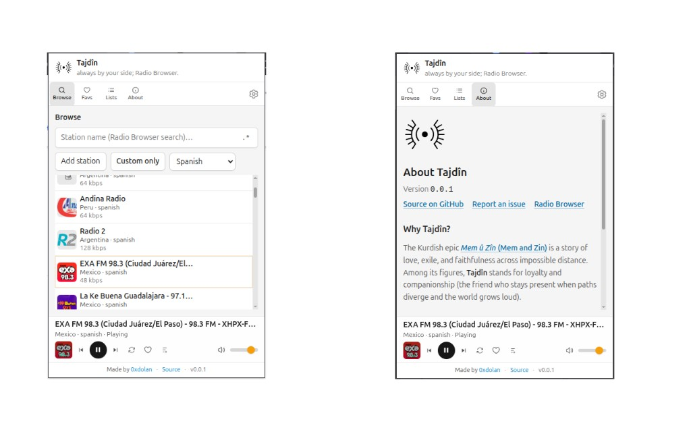

# Tajdîn

  

  Vector: <code>tajdin-logo-black.svg</code> / <code>tajdin-logo-white.svg</code> · Raster: <code>tajdin-logo-white.png</code> · Also <code>.jpg</code>, <code>.pdf</code> under <code>public/logo/</code> for print or other tools.

**Tajdîn** — always by your side; Radio Browser. A Chrome extension (**Manifest V3**, **Chrome 116+**) for discovering and playing stations via the [Radio Browser](https://www.radio-browser.info/) public API. Compact **popup** (Browse, Favs, Lists, About), **background playback** through an offscreen document, and a full-tab **options** page.

  

  <strong>Left:</strong> Browse — search, language filter, station list, player bar. <strong>Right:</strong> About — version, links, and <em>Why Tajdîn?</em> (Mem û Zîn).

## What it does

- **Browse and search** — Stations by name with exact or regex mode, language filter (default includes a **curated Kurdish** list bundled in the extension), random discovery when idle, optional **custom stations only** mode.
- **Play in the background** — Audio in an offscreen page; **service worker** + `chrome.offscreen` + **alarms** keep playback alive. **Session state** (current station, playlist position, volume) lives in `chrome.storage.session` so shortcuts work with the popup closed.
- **Controls** — **Keyboard shortcuts** (defaults: media play/pause, next, previous, mute; **open popup** has no default—add it at `chrome://extensions/shortcuts`; all commands are remappable there) and **OS media keys** / lock screen where Chromium exposes **Media Session** for the offscreen player.
- **Feedback** — Short **playback error** messages (toast + `aria-live`) when a stream fails; playlist-aware copy when skips apply. **Welcome tips** strip (dismissible, stored in settings).
- **Your library** — **Favourites**, **playlists** (ordered lists, drag-and-drop edit, optional skip-on-failed-stream), and **custom stations** in `chrome.storage.local`. **Playlist delete** offers a short **Undo** window.
- **Settings & data** — Theme, popup size, search defaults, backup **export/import** JSON (**merge** unions favourites and updates matching IDs; **replace** overwrites per section). **Copy** actions use the **clipboardWrite** permission.

Task tracking lives in **Task Master** (`.taskmaster/tasks/tasks.json`). The product requirements document is **`.taskmaster/docs/tajdin-prd-v1.txt`** (optional **`.docx`** alongside it).

## Quick links

- **Setup, build, load unpacked, tests, layout:** [docs/development.md](docs/development.md)
- **Product / UX spec:** [.taskmaster/docs/tajdin-prd-v1.txt](.taskmaster/docs/tajdin-prd-v1.txt)
- **Branching:** integrate on `develop`; `main` only with explicit maintainer approval (see `.cursor/rules/git-flow.mdc`)
- **Security:** [SECURITY.md](SECURITY.md) · **Privacy (store listing):** [docs/privacy-policy.md](docs/privacy-policy.md)

## Logo and icons

- **`public/logo/`** — **SVG** (UI via `tajdinMarkSvgUrl()`), **PNG** / **JPG** / **PDF** for README, stores, print. Black for light backgrounds; white for dark.
- **README** — Uses **`tajdin-logo-black.png`** for broad client compatibility.
- **Extension UI** — Packaged **`logo/*.svg`** via `chrome.runtime.getURL` for a sharp mark in the popup and settings.
- **Toolbar / manifest** — **`logo/tajdin-logo-black.png`** at 16/32/48; **128** uses **`logo/tajdin-extension-icon-128.png`** (96×96 mark + 16px transparent padding per Chrome Web Store icon rules; regenerate with `npm run generate:icon-128`). Vite copies **`public/logo/`** into **`dist/logo/`** on build.
