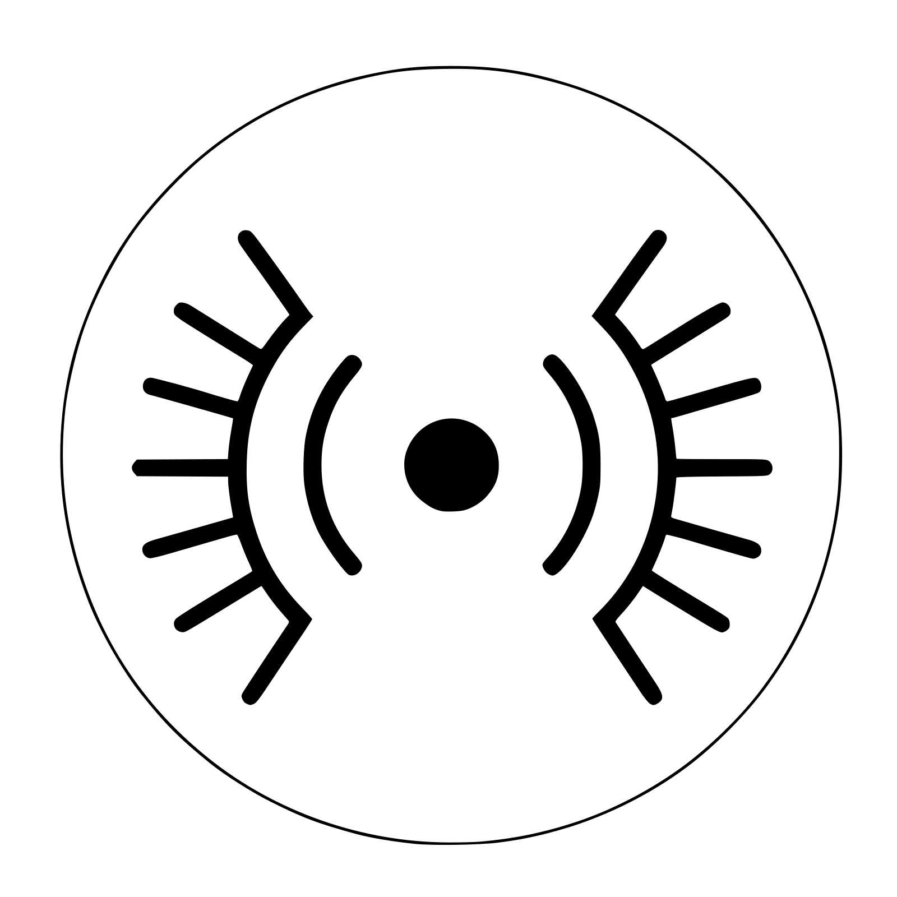

# Tajdîn

  

  Vector: <code>tajdin-logo-black.svg</code> / <code>tajdin-logo-white.svg</code> · Raster: <code>tajdin-logo-white.png</code> · Also <code>.jpg</code>, <code>.pdf</code> under <code>public/logo/</code> for print or other tools.

**Tajdîn** - always by your side; Radio Browser. A Chrome extension (Manifest V3) for discovering and playing stations via the [Radio Browser](https://www.radio-browser.info/) public API. Compact popup UI, background playback through an offscreen audio document, playlists, favourites, and settings you can tune over time.

## What it does

- **Browse and search** — Find stations by name, language, country, tags, and more (API integration with primary + fallback hosts).
- **Play in the background** — Audio runs in an offscreen document so playback can continue when the popup closes (service worker + `chrome.offscreen`, alarms for keep-alive — see Task Master / PRD for the full roadmap).
- **Your library** — Favourites, playlists, and custom stations (persisted in `chrome.storage`).
- **Settings** — Full-tab options page for theme, defaults, and data export/import.

Work in progress: features land incrementally; task order lives in `.taskmaster/tasks/tasks.json`.

## Quick links

- **Setup, build, load unpacked, tests:** [docs/development.md](docs/development.md)
- **Product / UX spec:** [.taskmaster/docs/zeng-prd-v1.txt](.taskmaster/docs/zeng-prd-v1.txt)
- **Branching:** integrate on `develop`; `main` only with explicit maintainer approval (see `.cursor/rules/git-flow.mdc`)
- **Security:** [SECURITY.md](SECURITY.md)

## Logo and icons

- **`public/logo/`** — Full set for references: **SVG** (scalable, used in the extension UI), **PNG** and **JPG** (previews, README, stores), **PDF** (print/share). Black variants for light backgrounds; white for dark.
- **README** — Uses **`tajdin-logo-black.png`** above (broad GitHub/client compatibility). You can switch the `` to `.svg` if you prefer vector in the repo view.
- **Extension UI** (popup header, settings, About) — Loads packaged **`logo/*.svg`** via `chrome.runtime.getURL` and `tajdinMarkSvgUrl()` so the mark stays sharp at any size.
- **Chrome toolbar / `manifest.json`** — **`public/logo/tajdin-logo-black.png`** for extension and action icons (Chromium needs raster; same asset at 16/32/48/128). Vite copies `public/` into `dist/` on build.
